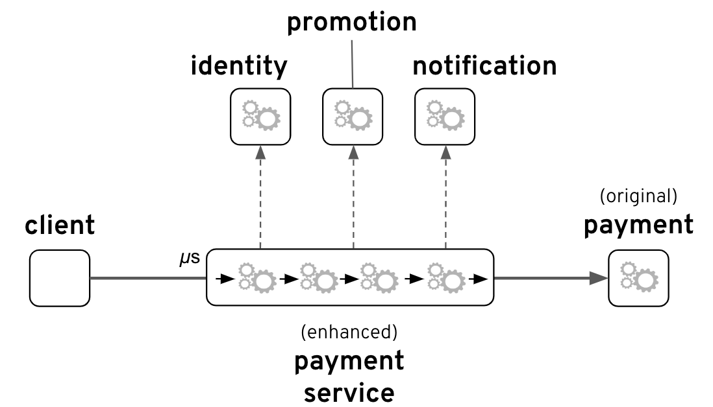

## Description

This repo contains all the material (source code) used to illustrate my article about open source observability capabilities you will find following the link below:

[https://brunonetid.github.io/](https://brunonetid.github.io/)

The '`demo`' folder contains the first example shown in the article to explain how to instrument an [*Apache Camel*](http://camel.apache.org/) application to enable tracing with [*OpenTracing*](https://opentracing.io/) and [*Jaeger*](https://www.jaegertracing.io/).

The second group of projects are formed by the following blocks:

  * `svc-payment`
  * `identity`
  * `promotion`
  * `payment`
  * `loyalty`
  * `fraud`

These are the sources to simulate the main scenario presented in the article. The use case represented is a composite service as depicted by the figure below:

